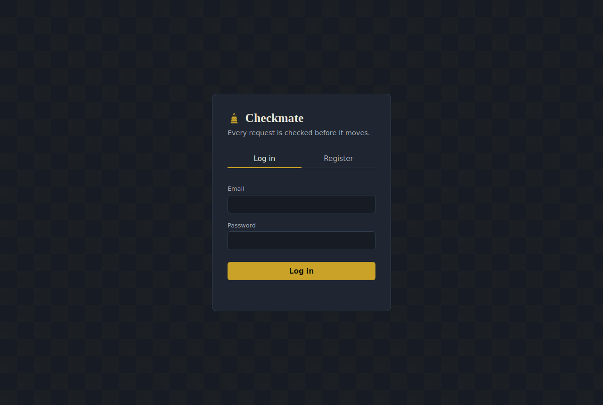
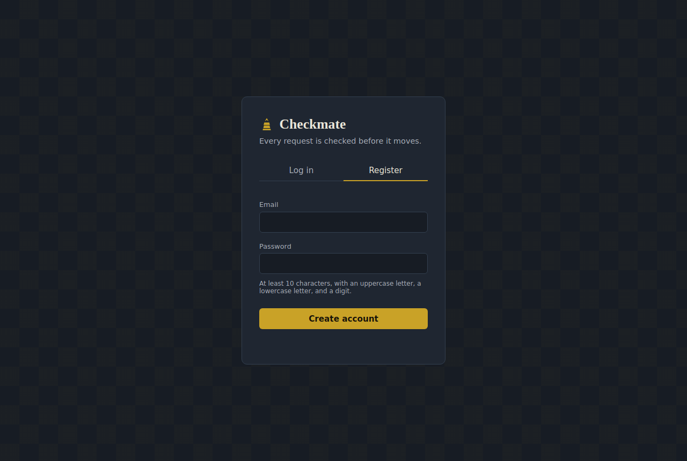
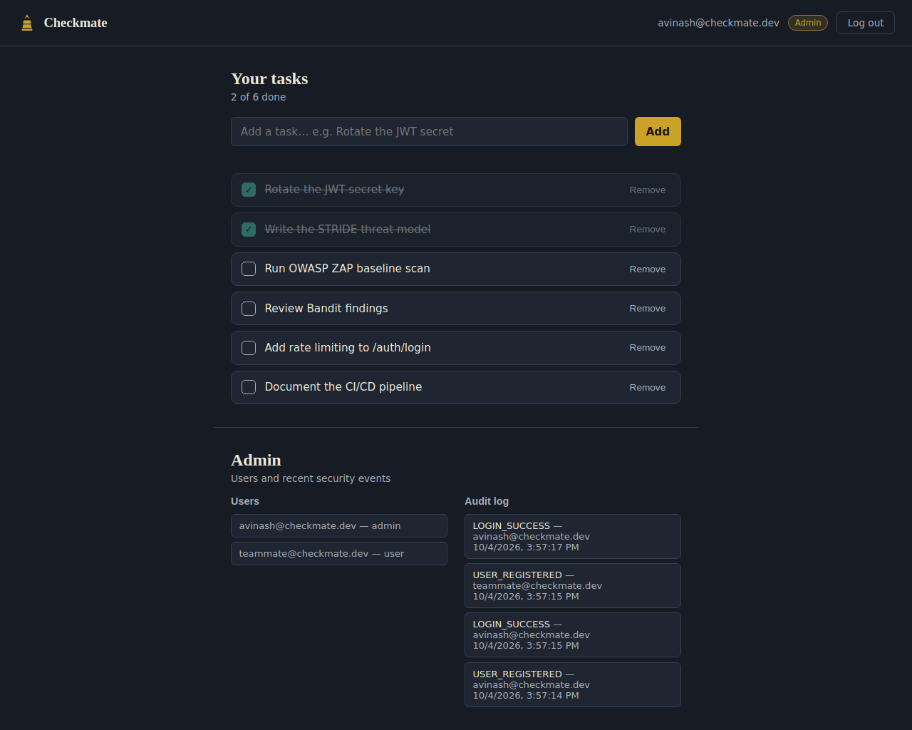
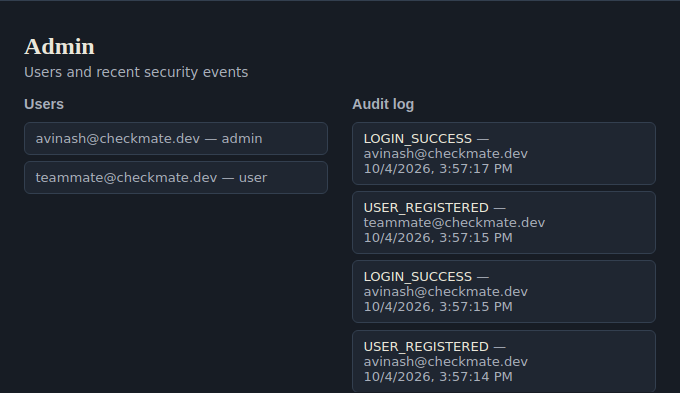
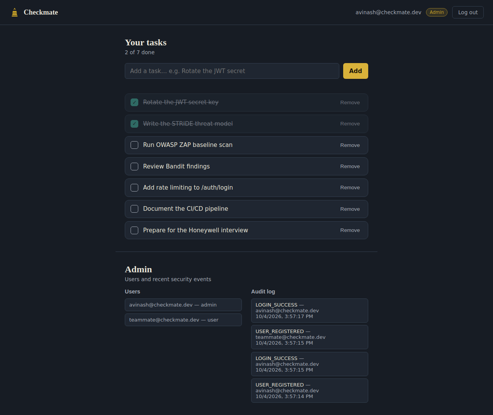

# Checkmate — Secure REST API with OWASP Protections

A task-management REST API (FastAPI + MySQL) with a real web frontend, built
to resist common attacks mapped to the OWASP Top 10. See
`docs/threat_model.md` for the threat model and `docs/security_report.md`
for scan results.

## Screenshots

| Login | Register |
|---|---|
|  |  |

**Dashboard** — task list plus the admin panel (users + audit log), shown to the first registered account:



**Admin panel close-up** — real users and a live security audit log, not placeholder data:



**Adding a task live:**



## Features

- A real web frontend at `/app` — login/register screen and a task dashboard, no Swagger UI needed for everyday use
- JWT authentication, Argon2 password hashing
- Role-based access control (user / admin)
- Per-user object-level authorization (no IDOR)
- Strict input validation (Pydantic, `extra="forbid"`)
- Parameterized queries via SQLAlchemy (no raw SQL)
- Rate limiting on login
- Security response headers
- Structured audit logging
- pytest security test suite
- GitHub Actions CI with Bandit + pip-audit

## Screenshots

**Login / Register** — a single card with tabs, dark slate theme, brass accent.


**Task dashboard** — add, complete, and remove tasks. Each person only ever
sees their own tasks (enforced server-side, not just hidden in the UI).


**Admin panel** — visible only to the first registered account (which becomes
admin automatically). Shows every user and a live security audit log
(logins, registrations, task deletions). A non-admin user never sees this
panel, and hitting the underlying `/admin/*` endpoints directly as a normal
user returns `403 Forbidden`.


## Architecture

`client -> security headers/rate limit -> JWT auth -> RBAC -> Pydantic
validation -> service layer (ownership checks) -> SQLAlchemy ORM -> MySQL`.

---

## Running locally — Option A: Docker (recommended, easiest)

Everything here is free and runs only on your computer.

1. Install **Docker Desktop**: https://www.docker.com/products/docker-desktop/
2. Copy the environment template:
   ```bash
   cp .env.example .env
   ```
3. Open `.env` and set a real random `JWT_SECRET_KEY`:
   ```bash
   python -c "import secrets; print(secrets.token_hex(32))"
   ```
   Paste the output as the value of `JWT_SECRET_KEY` in `.env`.
4. Start everything (API + MySQL):
   ```bash
   docker compose up --build
   ```
5. Open **http://localhost:8000/app/** in your browser — this is the actual
   Checkmate web app (register, log in, manage tasks). The first account you
   register becomes an admin and also sees a users/audit-log panel.
6. The interactive API documentation (Swagger UI) is still available at
   http://localhost:8000/docs if you want to test endpoints directly.
7. The `api` service waits for MySQL's health check before starting.

To stop: `docker compose down` (add `-v` to also delete the database volume).

---

## Running locally — Option B: Without Docker

1. Install **Python 3.12**: https://www.python.org/downloads/
2. Install **MySQL Community Server** (free): https://dev.mysql.com/downloads/mysql/
3. Create the database and a dedicated least-privilege user (open a MySQL shell):
   ```sql
   CREATE DATABASE checkmate;
   CREATE USER 'checkmate_user'@'localhost' IDENTIFIED BY 'changeme';
   GRANT SELECT, INSERT, UPDATE, DELETE ON checkmate.* TO 'checkmate_user'@'localhost';
   FLUSH PRIVILEGES;
   ```
4. Create a virtual environment and install dependencies:
   ```bash
   python -m venv venv
   source venv/bin/activate        # on Windows: venv\Scripts\activate
   pip install -r requirements.txt
   ```
5. Copy `.env.example` to `.env`, fill in `JWT_SECRET_KEY` (see step 3 in
   Option A) and your `DATABASE_URL` (the default already matches the SQL above).
6. Run the app:
   ```bash
   uvicorn app.main:app --reload
   ```
7. Open http://localhost:8000/app/ for the web app, or http://localhost:8000/docs for the API docs

---

## Running the tests

Tests use an isolated in-memory SQLite database automatically — you do **not**
need MySQL running to run tests.

```bash
pip install -r requirements.txt
pytest -v
```

## Running security scans locally (all free)

```bash
pip install bandit pip-audit
bandit -r app -ll
pip-audit -r requirements.txt
```

For OWASP ZAP (DAST), with the app running at `localhost:8000`:
```bash
docker run -t zaproxy/zap-stable zap-baseline.py -t http://host.docker.internal:8000
```
(On Linux, use your machine's IP instead of `host.docker.internal`, or run
`--network host`.)

Fill in the results in `docs/security_report.md`.

---

## Trying it out (example requests)

```bash
# Register (first registered user automatically becomes admin)
curl -X POST http://localhost:8000/auth/register \
  -H "Content-Type: application/json" \
  -d '{"email":"you@example.com","password":"StrongPass123"}'

# Log in
curl -X POST http://localhost:8000/auth/login \
  -H "Content-Type: application/json" \
  -d '{"email":"you@example.com","password":"StrongPass123"}'
# -> copy the access_token from the response

# Create a task (replace TOKEN)
curl -X POST http://localhost:8000/tasks \
  -H "Authorization: Bearer TOKEN" \
  -H "Content-Type: application/json" \
  -d '{"title":"Learn secure coding"}'
```

Or just use the Swagger UI at `/docs` — click "Authorize" and paste your token.

## Project structure

```
checkmate/
├── app/
│   ├── main.py              # app entrypoint, middleware, routers
│   ├── core/                 # config, security (hashing/JWT), auth deps
│   ├── models/                # SQLAlchemy models
│   ├── schemas/                # Pydantic request/response schemas
│   ├── routers/                 # auth, tasks, admin endpoints
│   ├── services/                 # audit logging
│   └── middleware/                # security headers
├── tests/                    # pytest security test suite
├── docs/                     # threat model, security report
├── .github/workflows/ci.yml  # CI: tests, Bandit, pip-audit, Docker build
├── Dockerfile
├── docker-compose.yml        # API + local MySQL, one command
└── .env.example
```

## Notes on secrets

- `.env` is listed in `.gitignore` — never commit it.
- `.env.example` has no real secrets, only placeholders — safe to commit.
- Regenerate `JWT_SECRET_KEY` before using this anywhere beyond local practice.
